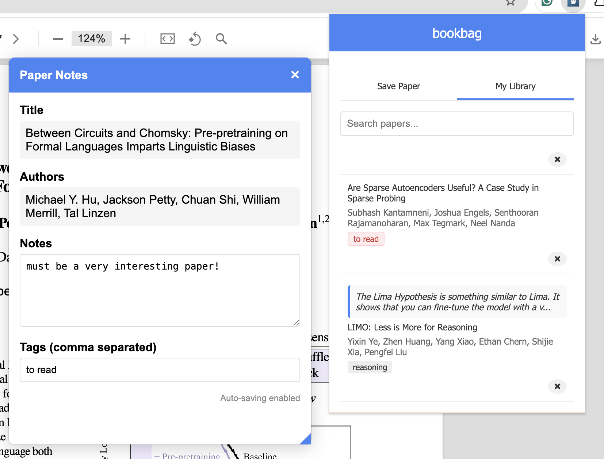

# bookbag

A Chrome extension to save and organize academic papers with notes and citations.

## Features

- Save papers from arXiv with a single click
- Add notes and tags to each paper
- Automatically extracts paper information (title, authors, etc.)
- Retrieves basic citations for saved papers
- Browse your saved papers in a clean interface
- Search through your paper library
- Delete papers from your library
- View and edit your notes directly from the saved PDF
- Non-intrusive floating popup that allows reading while taking notes
- Draggable and resizable popup windows
- Keyboard shortcuts for quick access

## Installation

1. Clone or download this repository
2. Open Chrome and navigate to `chrome://extensions/`
3. Enable "Developer mode" at the top right
4. Click "Load unpacked" and select the extension directory
5. The extension should now be installed and visible in your browser toolbar

## Creating Icons

Before using the extension, you need to create icons for it. Create the following files in the `images` directory:

- `icon16.png` (16x16 pixels)
- `icon48.png` (48x48 pixels)
- `icon128.png` (128x128 pixels)

You can create simple icons using any image editor, or use a placeholder icon generator.

## Usage

### Saving Papers

1. Navigate to an arXiv paper page (abstract or PDF)
2. Click the extension icon in the Chrome toolbar
3. Add your notes and tags in the popup
4. Click "Save Paper"

### Quick Save

Press Ctrl+Shift+P (or Command+Shift+P on Mac) while on an arXiv page to quickly save a paper. This will open a floating popup that lets you take notes while still being able to read and scroll through the paper.

### Save to Read Later

Press Ctrl+Shift+O (or Command+Shift+O on Mac) while on an arXiv page to instantly save the paper to your library with the "to read" tag. This saves the paper without opening any popup, allowing you to quickly build a reading list.

The "to read" tag appears in red in your library for easy identification of papers you've saved to read later.

### Browsing Your Library

1. Click on the extension icon or press Ctrl+Shift+L (or Command+Shift+L on Mac)
2. Navigate to the "My Library" tab
3. Browse through your saved papers
4. Use the search bar to filter papers by title, notes, or tags
5. Click on any paper to open it in a new tab with your notes

### Viewing and Editing Saved Notes

1. Click on any paper in your library to open it
2. The paper will open in PDF view
3. The notes popup will automatically appear on the right side of the screen
4. View and edit your existing notes directly from this popup
5. Click "Update Notes" to save any changes
6. Your updated notes will be saved immediately

### Deleting Papers

1. Navigate to the "My Library" tab
2. For any paper, click the "×" button to delete it
3. Confirm the deletion when prompted

### Using the Floating Note-Taking Popup

- The popup appears on the right side of the screen, allowing you to read the paper while taking notes
- You can continue to scroll and interact with the paper while the popup is open
- **Moving:** Click and drag the blue header bar at the top of the popup to move it anywhere on your screen
- **Resizing:** Click and drag the bottom-right corner of the popup to resize it 
- **Closing:** Click the "×" button in the top-right corner or press the ESC key

#### Troubleshooting Popup Movement

If you're having trouble moving the popup:
- Make sure to click and drag directly on the blue header bar
- Look for the three horizontal line indicator (≡) and try dragging from there
- Try clicking and holding for a brief moment before dragging
- Ensure you're dragging with the primary (left) mouse button

## License

MIT

## Limitations

- Currently only works with arXiv pages
- All data is stored locally in your browser 